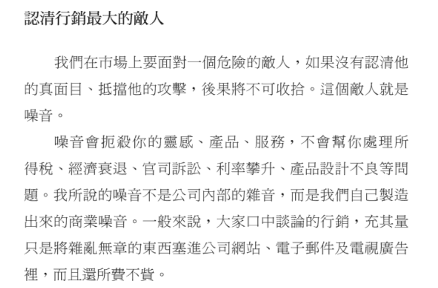

# 由建築視角入門前端

網頁介面(Web Interface)主要由三個兄弟組成，大哥 HTML，二哥 CSS，三哥JavaScript。

在邊可以把網頁介面視為一棟建築，由三兄弟來營造，大哥 HTML 主要負責的是建築架構設計、二哥 CSS是建築外觀工程、而三哥 JavaScript 則是負責建築施造(包含功能，電梯等等)，而瀏覽器就是業主，負責來使用與檢視這棟由這三兄弟蓋起來的大樓。

.png>).png>)

## HTML 5

使用標籤(tag)，也就是角括號組成，即使寫錯了，強大的瀏覽器也能讀懂並呈現，先練習幾種主要使用的標籤，了解撰寫邏輯，就能學習。一對的標籤，在開始與結束標籤中，通常會有內容，不一樣的標籤，也賦予標籤內容不一樣的效果，而 HTML 最可以注意到的就是巢狀結構，一層一層包覆的概念，跟建築物的結構架構也蠻相似的，而這些結構節點(node)及元素(elelmemt)會組成[(DOM)文件物件模型](dom-wen-jian-wu-jian-mo-xing.md)

常用到的 HTML tag，正確的使用 HTML 標籤，呈現[語義化的結構，也有可能讓 SEO 排名提升](yu-yi-hua-jie-gou-yu-seo.md)

* `<h1~6>`  - head title 標題標籤
* `<p>` - paragraph 段落標籤
* `<a href="">` anchor 錨點/連結標籤
* `` image 相片標籤
* `<ul>/<ol>` unordered list/orded list 無序/有序標籤
* `<li>` list 列表標籤，通常會被包在\<ul>/\<ol>內
* `<div>` divison 區塊標籤
* `<form>` 表單標籤

### Attribute

另外，可以看到在 img、a 這些元素(element)上，有 src 及 href 的字樣，這些都是叫做屬性(attribute)，屬性並不是元素，而是附加在元素上的資訊，如果每個元素都視為建材，那屬性(attribute)就像是這些建材上的編號，可以反映出這些建材更多的資訊，像是從哪裡來、大小、說明等等

#### **Goble Attribute全域屬性**

**全域屬性是可以在幾乎所有的元素(element)上做為使用的，常見的有 `class`   、`id`     **    &#x20;

`class` 可以想像成建材上的追蹤QR碼，一掃就能知道樣式

`ID` 也是一樣，可以想像成防盜碼，每個ID都獨一無二的，因為一個ID只能在一個元素上使用一次


****


```
// HTML
<!DOCTYPE html>
<html>
<head>
    <meta charset="utf-8" />
    <title>mypage</title>
</head>
<body>
    <div>
        <h1 class="myPage">我的頁</h1>
        
        <a href="https://app.gitbook.com/s/Sld1iuwZ8oycw1kgJRiR/">contact me</a>
        <div>
            <ul class="list">
                <li>1</li>
                <li id="two">2</li>
                <li id="three">3</li>
                <li>4</li>
            </ul>
        </div>
    </div>
</body>
</html>
```

## CSS

(Cascading Stylesheets) 階層樣式表，顧名思義，得使用像一階一階的樣式書寫來達到我們要


事件驅動模式​

`<!DOCTYPE html>`  給瀏覽器知道是HTML5，有點像是整個建築的logo一看就知道(x雄)


``

CSS樣式

JavavScript 功能
